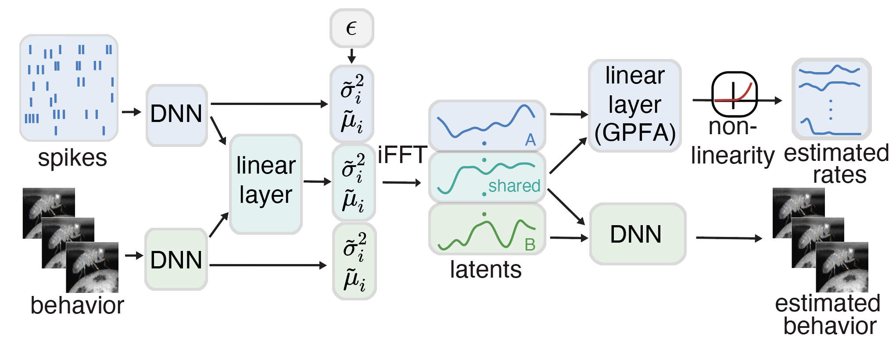

# Repository for Multi-Modal Gaussian Process Variational Autoencoder

Code accompanying the paper [Multi-modal Gaussian Process Variational Autoencoders for Neural and Behavioral Data](https://openreview.net/pdf?id=aGH43rjoe4) [1].

<p align="center">
  
</p>

[1] Gondur, R., Sikandar, U. B., Schaffer, E., Aoi, M. C., & Keeley, S. L. Multi-modal Gaussian Process Variational Autoencoders for Neural and Behavioral Data, The Twelfth International Conference on Learning Representations, 2024, Vienna, Austria.

## Required Packages
```
- python 3.8.13
- torch 1.12.0
- numpy 1.23.1
- matplotlib 3.5.2
- scipy 1.9.0
- scikit-learn 1.1.1
```
## To run Fourier MM-GPVAE with MNIST without any flags:

1) Download the full MNIST dataset from the internet. Once you have the dataset, put its path to the ```PATH``` variable in the data_generator.py. 
2) Create a python environment with the packages listed above.
3) Generate the modified MNIST data using data_generator.py, make sure to set ```NO_ZOOM``` to False.
4) Make sure that you uncommented the MMGPVAE hyperparameters in hyperparams.py
5) Run mmgpvae_without_flags.py


## To run Fourier MM-GPVAE and its varients with MNIST dataset:

1) Download the full MNIST dataset from the internet. Once you have the dataset, put its path to the ```PATH``` variable in the data_generator.py. 
2) Create a python environment with the packages listed above.
3) Generate the modified MNIST data using data_generator.py, make sure to set ```NO_ZOOM``` to False. (The data_generator.py creates a file with a default name that already matches with the file path in the dataloder of the MMGPVAE notebook. You can change the file name in the data_generator.py, if you do, you will have to change the path to the data (```DATA_PATH```) in the MMGPVAE notebook.)
4) Run MMGPVAE.ipynb

## To run Fourier GPVAE with MNIST dataset:

1) Download the full MNIST dataset from the internet. Once you have the dataset, put its path to the ```PATH``` variable in the data_generator.py. 
2) Create a python environment with the packages listed above.
3) Generate the modified MNIST data using data_generator.py, make sure to set ```NO_ZOOM``` to True. (The data_generator.py creates a file with a default name that already matches with the file path in the dataloder of the GPVAE notebook. You can change the file name in the data_generator.py, if you do, you will have to change the path to the data (```DATA_PATH```) in the GPVAE notebook.)
4) Run GPVAE.ipynb 

## Summary of directory contents:

- **MMGPVAE.ipynb**: The entire MM-GPVAE code for the simulated example. This code will train the model and plot the results on testing data.
- **GPVAE.ipynb**: The entire GPVAE code for the simulated example. This code will train the model and plot the results on testing data.
- **data_generator.py**: This will apply the modifications to the MNIST digit to be used in the MMGPVAE.ipynb and GPVAE.ipynb. To get the data for MM-GPVAE, run it as usual, if you would like to turn off the 'zoom', comment out the specified line ```img = clipped_zoom(img, abs(np.squeeze(GP_zooms[n, angle_img_idx])))```
- **GP_fourier**: You don't need to run anything in this folder, it is just a dependency for the MMGPVAE and GPVAE notebook.
- **train.py, misc.py, hyperparams.py, neural_nets.py**: All of these contain the dependencies to run MMGPVAE.ipynb and GPVAE.ipynb.
- **mmgpvae_without_flags**: This is similar to MMGPVAE.ipynb but in a single python script and without any flags (e.g. no GPFA or GPVAE training options)

## Citation

If you use any part of this code in your research, please cite our [paper]([https://arxiv.org/abs/1810.11738](https://openreview.net/pdf?id=aGH43rjoe4)):

```
@inproceedings{gondurmulti,
  title={Multi-modal Gaussian Process Variational Autoencoders for Neural and Behavioral Data},
  author={Gondur, Rabia and Sikandar, Usama Bin and Schaffer, Evan and Aoi, Mikio Christian and Keeley, Stephen L},
  booktitle={The Twelfth International Conference on Learning Representations}
}
```

## License

This project is licensed under the MIT License -
see the [LICENSE](LICENSE) file for details


